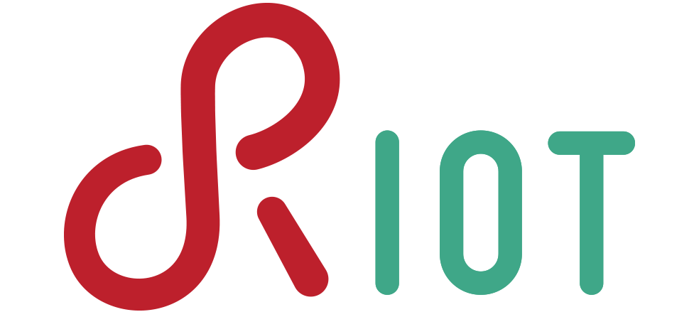
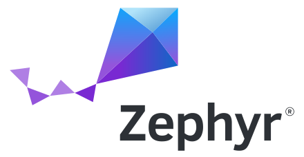
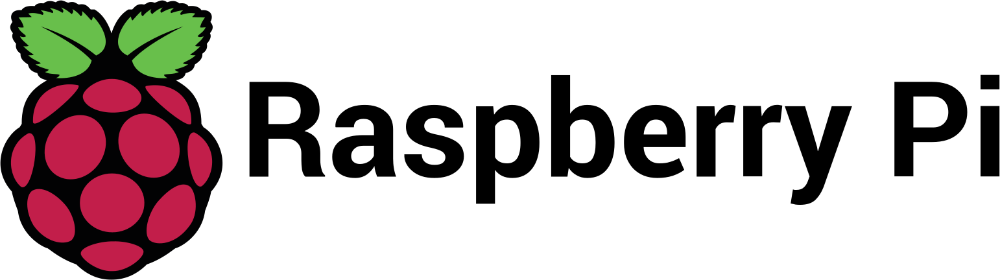

# Getting Started

reactor-uc provides template repositories for different platforms, SDKs, or RTOSes. Inside these template repositories, our reactor-uc and Lingua Franca compile flow is integrated. You can use the platform-specific tooling as it is a regular project.

--- 

Select one of the following platforms on which you want to build upon.

-   :material-clock-fast:{ .lg .middle } __RIOT-OS__

    ---
        
    
     Welcome to the friendly Operating System for the Internet of Things.

    [:octicons-arrow-right-24: lf-riot-uc-template](#)

-   :fontawesome-brands-markdown:{ .lg .middle } __Zephyr__

    ---

    

    Build secure, connected, future-proof devices with Zephyr. A proven RTOS ecosystem, by developers, for developers.

    [:octicons-arrow-right-24: lf-zephyr-uc-template](#)

-   :material-format-font:{ .lg .middle } __Raspberry PI Pico__

    ---

    
    
    The Raspberry Pi Pico series is a range of tiny, fast, and versatile boards built using RP2040, the flagship microcontroller chip designed by Raspberry Pi in the UK

    [:octicons-arrow-right-24: lf-pico-uc-template](#)

-   :material-scale-balance:{ .lg .middle } __FreeRTOS__

    ---

    

    Real-time operating system for microcontrollers and small microprocessors

    [:octicons-arrow-right-24: lf-freertos-uc-template](#)

See the full list of supported platforms  

