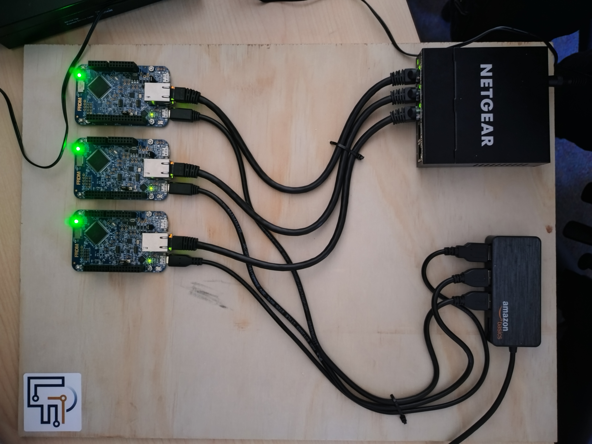

# NXP FRDM K64F Distributed Computing

{ width="400" }


```lf
federated reactor {
    @platform_zephyr
    node_0 = new FRDMK64FBoard();
    @platform_zephyr
    node_1 = new FRDMK64FBoard();
    @platform_zephyr
    node_2 = new FRDMK64FBoard();
}


```


