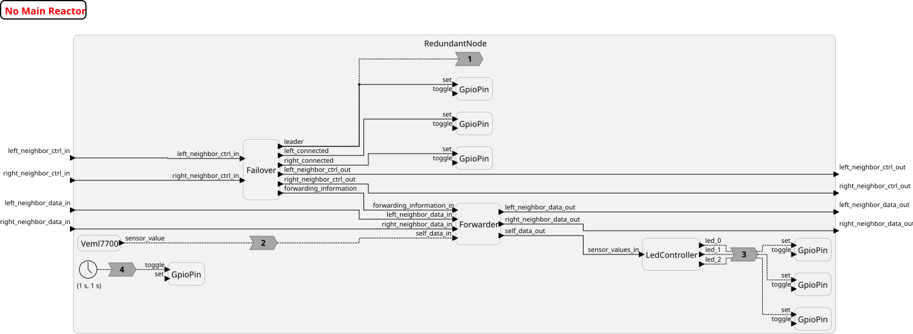

# Redundant Picos

A fault-tolerant flight controller using federated reactor-uc execution across multiple Raspberry Pi Pico boards connected by UART.


## Overview

This project demonstrates **hardware redundancy** and **automatic leader election** using reactor-uc's peer-to-peer federated execution on Raspberry Pi Pico microcontrollers. Multiple Pico boards form a ring network over UART and independently agree on which node is the current leader. The leader aggregates sensor readings from all nodes and drives the actuators; if it crashes, the remaining nodes elect a new leader without any external coordinator.

The project was presented at the [Flight Software Workshop 2025](https://flightsoftware.org/workshop/FSW2025).

## Architecture

Three nodes are connected in a ring. Each node has a left and a right UART neighbor. All communication is peer-to-peer — there is no central RTI. Each node runs an **identical** reactor program; the `my_id`, `left`, and `right` parameters are the only per-node configuration.



## Shared Types

All nodes share two types defined in `common.h`:

```c
// Routing decision made by the Failover reactor
typedef enum {
    ForwardLeft  = 1,
    ForwardRight = 2,
    ForwardSelf  = 3,
} ForwardInformation;

// Sensor reading with its originating node ID
typedef struct {
    int source;
    int value;
} FederatedData;
```

## Reactor Breakdown

### `Failover` — Distributed Leader Election

`Failover` implements a simple, decentralized fault-detection and leader-election algorithm using a **visibility table**: a 3×3 boolean matrix where `visibility_table[i*3 + j]` means node `i` can see node `j`.

Each node periodically broadcasts its row of the visibility table to both neighbors (`ping_neighbors` timer). When a message arrives, the node updates the sender's row and records the arrival time. If no message arrives from a neighbor within `ASSUME_DEAD` (750 ms), the corresponding entry is set to false.

```lf
reactor Failover(my_id: int = 0, left: int = 1, right: int = 2,
                 offset: interval_t = 100msec) {

    timer ping_neighbors(offset, 500msec);
    timer perform_failover(1sec, 500msec);

    state visibility_table: bool[9];
    state last_received: instant_t[2]; // left, right

    reaction (ping_neighbors) -> left_neighbor_ctrl_out, right_neighbor_ctrl_out {=
        instant_t now = env->get_physical_time(env);

        // Mark neighbors as dead if last heartbeat was too long ago
        visibility_table[my_id*3 + left]  = (now - last_received[0]) <= ASSUME_DEAD;
        visibility_table[my_id*3 + right] = (now - last_received[1]) <= ASSUME_DEAD;
        visibility_table[my_id*3 + my_id] = true;

        // Broadcast own row to both neighbors
        NeighborInformation info;
        memcpy(info.federates, &visibility_table[my_id*3], 3 * sizeof(bool));
        lf_set(left_neighbor_ctrl_out,  info);
        lf_set(right_neighbor_ctrl_out, info);
    =}
```

The leader election runs every 500 ms. Node 0 is elected leader unless it is considered dead by both other nodes, in which case node 1 takes over:

```lf
    reaction (perform_failover) -> leader, forwarding_information, ... {=
        // A node is online if at least one neighbor can see it
        online[0] = visibility_table[1*3+0] || visibility_table[2*3+0];
        online[1] = visibility_table[0*3+1] || visibility_table[2*3+1];
        online[2] = visibility_table[0*3+2] || visibility_table[1*3+2];
        online[my_id] = true; // always consider self online

        int leader_index = (!online[0] && online[1] && online[2]) ? 1 : 0;

        if (leader_index == my_id) {
            lf_set(leader, true);
            lf_set(forwarding_information, ForwardSelf);
        } else {
            lf_set(leader, false);
            // Route data towards the leader, going around a dead link if needed
            lf_set(forwarding_information,
                   leader_is_on_left && left_connected  ? ForwardLeft  :
                   leader_is_on_right && right_connected ? ForwardRight :
                   /* detour */                            ForwardRight);
        }
    =}
```

### `Forwarder` — Data Routing

`Forwarder` routes sensor data according to the `ForwardInformation` decision made by `Failover`. It has three input sources (left neighbor, right neighbor, self) and three output sinks. On each event it forwards the payload in exactly one direction:

```lf
reactor Forwarder {
    input  forwarding_information_in: ForwardInformation;
    input  left_neighbor_data_in:  FederatedData;
    input  right_neighbor_data_in: FederatedData;
    input  self_data_in:           FederatedData;
    output left_neighbor_data_out:  FederatedData;
    output right_neighbor_data_out: FederatedData;
    output self_data_out:           FederatedData;

    reaction (left_neighbor_data_in) -> ... {=
        switch (forwarding_information) {
            case ForwardLeft:  lf_set(left_neighbor_data_out,  value); break;
            case ForwardRight: lf_set(right_neighbor_data_out, value); break;
            case ForwardSelf:  lf_set(self_data_out,           value); break;
        }
    =}
    // identical reactions for right_neighbor_data_in and self_data_in
}
```

### `LedController` — Sensor Fusion

`LedController` accumulates `FederatedData` readings from any source, then on a periodic timer computes the average of all readings received since the last tick and drives three LEDs at thresholds 150, 300, and 500 lux:

```lf
reactor LedController(rate: interval_t = 250msec) {
    input  sensor_values_in: FederatedData;
    output led_0: bool;
    output led_1: bool;
    output led_2: bool;

    state available: bool[3];
    state values:    int[3];
    timer t(250msec, rate);

    reaction (sensor_values_in) {=
        available[sensor_values_in->value.source] = true;
        values[sensor_values_in->value.source]    = sensor_values_in->value.value;
    =}

    reaction (t) -> led_0, led_1, led_2 {=
        float avg = 0; int count = 0;
        for (int i = 0; i < 3; i++) {
            if (available[i]) { avg += values[i]; count++; available[i] = false; }
        }
        if (count == 0) return;
        avg /= count;
        lf_set(led_0, avg > 150.0);
        lf_set(led_1, avg > 300.0);
        lf_set(led_2, avg > 500.0);
    =}
}
```

### `RedundantNode` — Composition

`RedundantNode` wires the four reactors together and exposes the inter-federate ports at its boundary. The only GPIO-driving reaction guards actuator output behind the `leader` flag — non-leaders run all the same logic but never write to the center LEDs:

```lf
reactor RedundantNode(my_id: int = 0, left: int = 1, right: int = 2,
                      offset: interval_t = 10msec) {

    failover  = new Failover(my_id=my_id, left=left, right=right, offset=offset);
    forwarder = new Forwarder();
    veml7700  = new Veml7700(rate=500msec);      // light sensor
    controller = new LedController(rate=500msec);

    // Status LEDs wired directly from Failover outputs
    failover.leader          -> gpio_leader.set;
    failover.left_connected  -> gpio_left.set;
    failover.right_connected -> gpio_right.set;

    // Sensor pipeline: read → tag with own ID → route → accumulate → drive LEDs
    veml7700.sensor_value -> forwarder.self_data_in  // via reaction (adds source ID)
    forwarder.self_data_out -> controller.sensor_values_in;

    // Actuators: only the leader drives the center LEDs
    reaction (controller.led_0, controller.led_1, controller.led_2)
        -> gpio_center_0.set, gpio_center_1.set, gpio_center_2.set {=
        if (self->leader) {
            lf_set(gpio_center_0.set, controller.led_0->value);
            lf_set(gpio_center_1.set, controller.led_1->value);
            lf_set(gpio_center_2.set, controller.led_2->value);
        }
    =}

    // Federated ports passed through to/from neighbors
    left_neighbor_data_in  -> forwarder.left_neighbor_data_in;
    right_neighbor_data_in -> forwarder.right_neighbor_data_in;
    forwarder.left_neighbor_data_out  -> left_neighbor_data_out;
    forwarder.right_neighbor_data_out -> right_neighbor_data_out;
    failover.left_neighbor_ctrl_out   -> left_neighbor_ctrl_out;
    // ... (symmetric for right side)
}
```

## Federation Configuration

`FlightControllerReal.lf` instantiates three `RedundantNode` federates and wires them over UART. Each federate is configured entirely through annotations — there is no `target { }` property block.

```lf
target uC {
    platform: rp2040,
    logging: INFO,
    clock-sync: on
}

federated reactor {
    // Node 0 — grandmaster clock, uses uart1 for its right neighbor
    @interface_uart(name="uart1", uart_device=1, baud_rate=57600,
                    data_bits=8, parity="UART_PARITY_EVEN", stop_bits=1)
    @clock_sync(grandmaster=true, period=3500000000, max_adj=512000, kp=0.5, ki=0.1)
    node_0 = new RedundantNode(my_id=0, left=2, right=1, offset=10msec);

    // Node 1 — uses uart0 for its left neighbor (node 0)
    @interface_uart(name="uart0", uart_device=0, baud_rate=57600,
                    data_bits=8, parity="UART_PARITY_EVEN", stop_bits=1)
    @clock_sync(grandmaster=false, period=3500000000, max_adj=512000, kp=0.5, ki=0.1)
    node_1 = new RedundantNode(my_id=1, left=0, right=2, offset=20msec);

    // Control channel: node_0 right ↔ node_1 left, with 50ms logical delay
    @link(left="uart1", right="uart0")
    @buffer(10)
    node_0.right_neighbor_ctrl_out -> node_1.left_neighbor_ctrl_in after 50msec;

    // Data channel: node_0 right ↔ node_1 left
    @link(left="uart1", right="uart0")
    @buffer(10)
    node_0.right_neighbor_data_out -> node_1.left_neighbor_data_in after 50msec;

    // Symmetric return channels
    @link(left="uart0", right="uart1")
    @buffer(10)
    node_1.left_neighbor_ctrl_out -> node_0.right_neighbor_ctrl_in after 50msec;

    @link(left="uart0", right="uart1")
    @buffer(10)
    node_1.left_neighbor_data_out -> node_0.right_neighbor_data_in after 50msec;
}
```

Notable reactor-uc features in use:

- **`@interface_uart`** — defines a UART transport; no central RTI is needed
- **`@link`** — binds an LF connection to a named interface, multiplexing control and data over the same physical UART
- **`@buffer(10)`** — reserves static buffer space for up to 10 in-transit messages per connection
- **`@clock_sync`** — runs a PTP-like synchronisation loop so node clocks track node_0 (the grandmaster) without a GPS or NTP server
- **`after 50msec`** — adds a logical delay to account for UART transmission latency

## Building and Flashing

Clone the repository and build each federate separately:

```bash
git clone https://github.com/tanneberger/fsw25.git
cd fsw25
```

Flash node 0:

```bash
cmake -Bbuild . -DLF_MAIN=FlightControllerReal -DFEDERATE=node_0
cmake --build build
sudo picotool load -x build/LF_MAIN.elf
```

Flash node 1 (repeat with `DFEDERATE=node_1` on a second Pico):

```bash
cmake -Bbuild . -DLF_MAIN=FlightControllerReal -DFEDERATE=node_1
cmake --build build
sudo picotool load -x build/LF_MAIN.elf
```

Run the sensor self-test on a single board:

```bash
cmake -Bbuild . -DLF_MAIN=SensorTest
cmake --build build
sudo picotool load -x build/LF_MAIN.elf
```

## Repository

[:octicons-mark-github-16: tanneberger/fsw25](https://github.com/tanneberger/fsw25)
